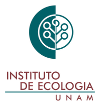

::: {.center-text .column-page-right .white-text}
```{=html}
<header class="hero">
  <div class="center-content white-text">
    <h1 class="white-text">Territorial Shifts in southern Yucatan</h1>
    <h3>The research project Territorial dynamics in the Calakmul-Sian Ka'an corridor is inserted in a key moment of possible transformation in the territory, therefore, the project seeks to understand how the territories evolve and have evolved in the face of development interventions, public policies, infrastructure, changes in land tenure regime and how these dynamics shape and affect the landscapes and changes and land use. Understanding the legacies and their link to current dynamics, gives the possibility to reflect on possible future paths and possibilities to cope with current transformations.<br><br> Our research group is a multidisciplinary team that comprises  undergraduate and graduate students (MA and PhD), as well as scholars from: Universidad Nacional Autónoma de México, and the Rutgers University.</h3>
      <a href="/about" class="button white-text">About Us</a>
  </div>
</header>
```
:::
---

::: {.column-page-right .center-text}
::: {.red-underline}
# **COLLABORATING INSTITUTIONS**
:::

::: {.collaborating-institutions}

<div class="institution-card">
  
  <p class="institution-text">Rutgers University</p>
  <a href="https://www.rutgers.edu/" role="button" class="btn btn-outline-light">Visit</a>
</div>

<div class="institution-card">
  
  <p class="institution-text">Facultad de Ciencias | UNAM</p>
  <a href="https://www.fciencias.unam.mx/" role="button" class="btn btn-outline-light">Visit</a>
</div>

<div class="institution-card">
  
  <p class="institution-text">Instituto de Ecología | UNAM</p>
  <a href="https://www.ecologia.unam.mx/web2/index.php/es/" role="button" class="btn btn-outline-light">Visit</a>
</div>

:::
:::
<br>

::: {.column-page-right .center-text}
::: {.red-underline}
# **OUR WORK** 
:::

### Explore details of the project

::: {.collaborating-institutions}

<div class="institution-card">
  
  <p class="institution-text">Project</p>
  <a href="our_work/" role="button" class="btn btn-outline-light">Explore</a>
</div>

<div class="institution-card">
  
  <p class="institution-text">Publications</p>
  <a href="../../research" role="button" class="btn btn-outline-light">Explore</a>
</div>

<div class="institution-card">
  
  <p class="institution-text">Research Group</p>
  <a href="about/" role="button" class="btn btn-outline-light">Explore</a>
</div>

:::
:::


<!---------------- START blog listing section (white div) ---------------->
::: {.column-page-right .center-text}
::: {.red-underline}
# **MORE ABOUT THE PROJECT**

<br>
:::
You can explore *Entre selvas y comunidades*, our outreach booklet on how development and conservation initiatives, along with public policies, shape communities and landscapes in the Calakmul-Sian Ka’an corridor. This project was made possible thanks to the support of Fulbright and the National Geographic Society.

<br>
```{css echo=FALSE}
.embed-container {
    position: relative;
    padding-bottom: 129%;
    height: 0;
    overflow: hidden;
    max-width: 100%;
}
.embed-container iframe,
.embed-container object,
.embed-container embed {
    position: absolute;
    top: 0;
    left: 0;
    width: 100%;
    height: 100%;
}
```

```{=html}
<p class="text-center">
  <a class="btn btn-primary btn-lg cv-download" href="`r rmarkdown::metadata$booklet$pdf`" target="_blank">
    <i class="fa-solid fa-file-arrow-down"></i>&ensp;Download our outreach booklet
  </a>
</p>
<div class="embed-container">
  <iframe src="`r rmarkdown::metadata$booklet$pdf`#toolbar=0" style="border: 0.5px;width: 100%;"></iframe>
</div>
```

:::
